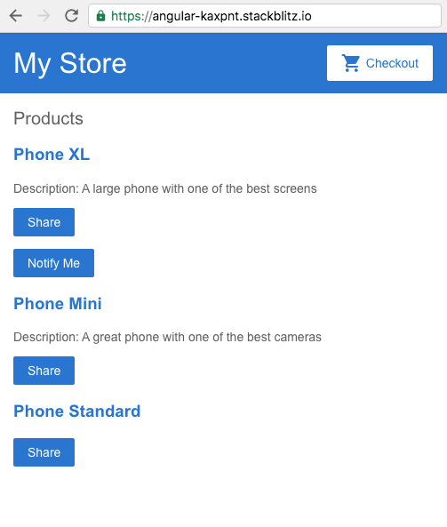
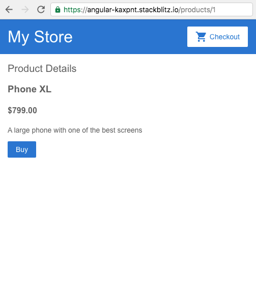
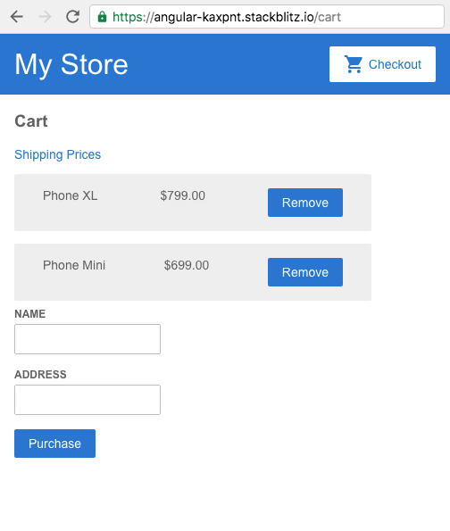

# angular-kaxpnt

Created from the [Angular.io getting started guide](https://angular.io/start#getting-started-with-angular), developed in the [StackBlitz IDE](https://stackblitz.com/edit/angular-kaxpnt)

## App Page Screenshots

### Homepage

### Product Details

### Cart

